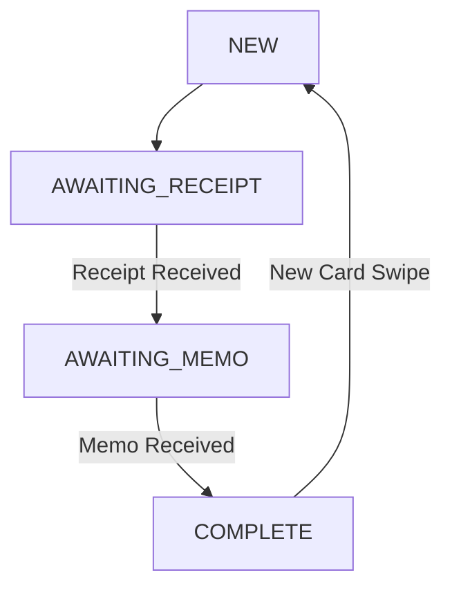

# SMS Receipt Collector

A Node.js/Express application that automates receipt collection via SMS using Twilio's API. Perfect for expense tracking and receipt management systems that need a simple user interface through text messages.

[](https://nodejs.org/)
[](https://expressjs.com/)
[](https://www.twilio.com/)

## Overview

This application provides a seamless way to collect receipts and memos via SMS after a card transaction. It uses a state machine to manage the flow of user interactions, from card swipe to receipt submission to memo collection.

## Features

- 📱 SMS-based user interface
- 📸 Receipt image collection via MMS
- 📝 Memo collection and storage
- 🔄 State-based interaction flow
- 🚀 Local tunnel for development
- 📊 Real-time state monitoring

## Tech Stack

- Node.js
- Express.js
- Twilio API
- localtunnel
- axios

## Prerequisites

- Node.js (14.x or higher)
- npm or yarn
- Twilio Account
  - Account SID
  - Auth Token
  - Twilio Phone Number

## Installation

1. Clone the repository:
```bash
git clone https://github.com/yourusername/sms-receipt-collector.git
cd sms-receipt-collector
```

2. Install dependencies:
```bash
npm install
```

3. Create a `.env` file in the root directory:
```env
PORT=3000
TWILIO_ACCOUNT_SID=your_account_sid
TWILIO_AUTH_TOKEN=your_auth_token
TWILIO_PHONE_NUMBER=your_twilio_number
```

## Configuration

Update the following constants in `server.js`:

```javascript
const accountSid = process.env.TWILIO_ACCOUNT_SID;
const authToken = process.env.TWILIO_AUTH_TOKEN;
const twilioPhoneNumber = process.env.TWILIO_PHONE_NUMBER;
```

## Usage

1. Start the server:
```bash
npm start
```

2. The server will:
   - Start on the specified port (default: 3000)
   - Create a tunnel using localtunnel
   - Display the public URL for Twilio webhook configuration

3. Configure your Twilio webhook URL:
   - Go to your Twilio console
   - Set the webhook URL to your tunnel URL (e.g., `https://your-subdomain.loca.lt/webhook`)
   - Set the HTTP method to POST

## State Machine

The application uses a state machine to manage user interactions:

```javascript
const STATES = {
  NEW: "NEW",                    // Initial state
  AWAITING_RECEIPT: "AWAITING_RECEIPT", // Waiting for receipt image
  AWAITING_MEMO: "AWAITING_MEMO",    // Waiting for memo text
  COMPLETE: "COMPLETE"           // Process completed
};
```

### State Flow



## API Endpoints

### POST `/webhook`
Handles incoming SMS messages from Twilio

Request Body:
```javascript
{
  "From": "string",  // Sender's phone number
  "NumMedia": "string", // Number of media attachments
  "MediaUrl0": "string" // URL of the first media attachment (if present)
}
```

### GET `/test-connection`
Tests server connectivity and displays current state

Response:
```javascript
{
  "status": "success",
  "message": "Server is connected to the internet",
  "serverTime": "2024-11-25T12:00:00.000Z",
  "userDatabase": {} // Current state of in-memory database
}
```

## Development

### Logging
The application includes comprehensive request logging:

```javascript
app.use((req, res, next) => {
  console.log(`${new Date().toISOString()} - ${req.method} request to ${req.url}`);
  console.log("Headers:", JSON.stringify(req.headers, null, 2));
  console.log("Body:", JSON.stringify(req.body, null, 2));
  next();
});
```

### Error Handling
Global error handling middleware is implemented:

```javascript
app.use((err, req, res, next) => {
  console.error("Unhandled error:", err.stack);
  res.status(500).send("Something broke!");
});
```

## Production Considerations

1. Database Implementation
   - Replace in-memory storage with a persistent database
   - Consider MongoDB or PostgreSQL

2. Security
   - Implement authentication
   - Secure environment variables
   - Add request rate limiting
   - Validate webhook signatures

3. Monitoring
   - Add application monitoring
   - Implement proper error tracking
   - Set up alerts for critical failures

4. Scaling
   - Implement load balancing
   - Add caching layer
   - Consider message queue for SMS processing


